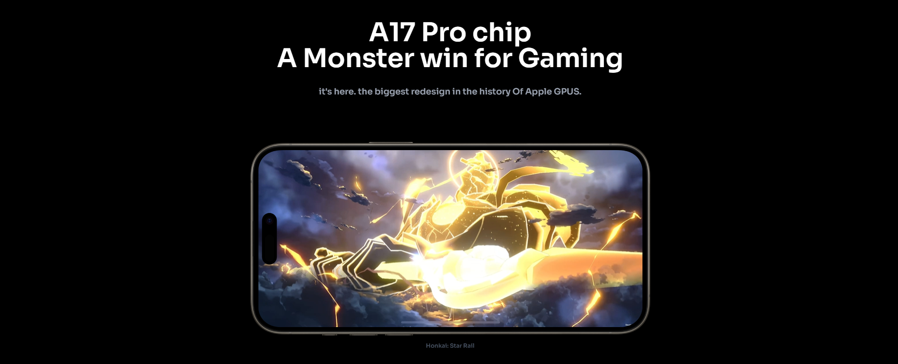

# [Apple iPhone 15 Pro Clone](https://apple-store-zoqf.vercel.app/)

  <h1>Apple iPhone 15 Pro Clone</h1>
  
  
  
    

  <!-- Badges -->
  
  
  
  

    

  <!-- Action Links -->
  
  &nbsp;&nbsp;
  

---

### Project Overview

* **3D Product Showcase:** Developed an interactive 3D product showcase website featuring responsive 3D model rendering via React Three Fiber. 
* **Smooth Animations:** Designed custom, smooth scroll-driven animations and a custom video carousel using GSAP to maximize user engagement. 
* **Optimized Architecture:** Architected reusable components and clean folder structures using Vite for optimized development and build speeds.

